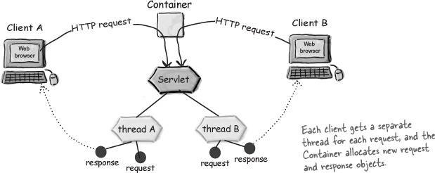
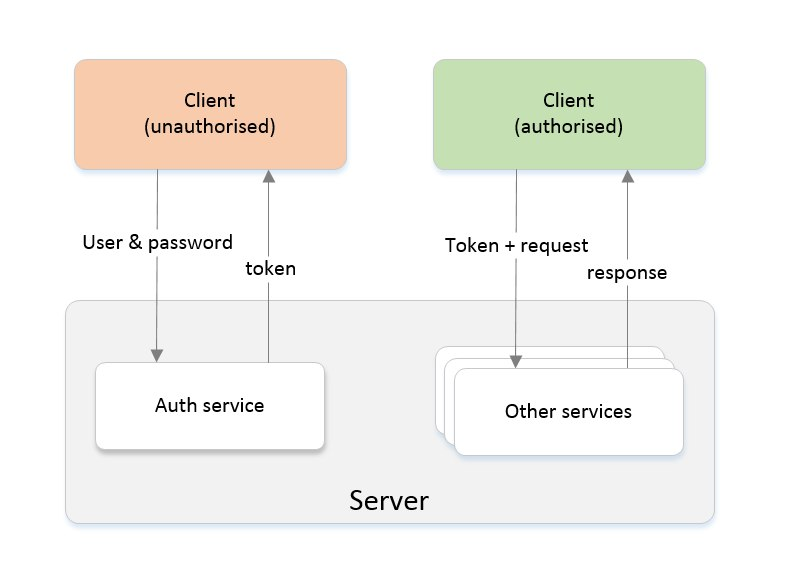

# Рубежный контроль \#1

## In-memory authentication HTTP-server

На **лекции 5** мы рассмотрели примеры web-сервисов на java:  
- Простейший пример web сервиса
[[hello world]](https://github.com/rybalkinsd/atom/tree/master/lecture05/src/main/java/ru/atom/jersey/hw)

- web-сервис **match maker**, в коротом реализован механизм авторизации
[[match maker]](https://github.com/rybalkinsd/atom/tree/master/lecture05/src/main/java/ru/atom/jersey/mm)

- кроме того, на **лекции 4** вы можете посмотреть на реализацию сервера чата
[[chat server]](https://github.com/rybalkinsd/atom/tree/master/lecture04/src/main/java/ru/atom/http/server)

## Технологический стек:
### Jetty
**[Jetty](http://www.eclipse.org/jetty/)** - встраиваемый веб-сервер и контейнер сервлетов.
Jetty передает обработку HTTP запросов соответствующим сервлетам ([Quick start tutorial](https://www.eclipse.org/jetty/documentation/current/quick-start.html))

**Jetty реализует модель thread per request** [[link]](http://stackoverflow.com/questions/15217524/what-is-the-difference-between-thread-per-connection-vs-thread-per-request)  
Это значит, что каждый запрос будет обработан в своем потоке:


### Jax-rs and Jersey
The Java API for RESTful Web Services (**Jax-rs**) - это [набор спецификаций](https://jcp.org/en/jsr/detail?id=311), описывающих простой интерфейс для написания REST-сервисов  
**[Jersey](https://jersey.java.net/)** - реализация Jax-rs, популярный web-framework

**Полезные статьи про Jax-rs:**
- [на Хабре](https://habrahabr.ru/post/140181/)
- [в блоге IBM](https://www.ibm.com/developerworks/ru/library/wa-jaxrs/)
- [туториал от Oracle](http://docs.oracle.com/javaee/6/tutorial/doc/gilik.html)
**Обратите внимание** на механизм валидации токенов и *фильтры*.

### JSON
Спиок пользователей будем возвращать в популярном формате [JSON](https://www.w3schools.com/js/js_json_intro.asp)

## Задание
Основываясь на примерах из лекций 4 и 5, вам нужно разработать **In-memory authentication HTTP-server** (далее AuthServer).
AuthServer должен удовлетворять API, описанному далее.

## Форма и сроки сдачи
- `git checkout -b rk1 upstream/rk1` после этого работаете в ветки
- Срок сдачи: **29 марта** на лекции. Целое занятие будет посвящено сдаче этого задания.
- Задание выполняется индивидуально
- Формат сдачи:
    1. вы показываете свой красивый PR с выполненным билдом
    1. смотрим тесты и полноту тестового покрытия
    1. вы поднимаете свой AuthServer
    1. вы запускаете тесты на каждый из ресурсных методов
    1. мы делаем запросы к вашему сервису 
    1. смотрим код AuthServer'а и обсуждаем его    
- Если нам что-то не нравится на одном из этапов - попросим внести коррективы прямо на паре
- Максимальное количество баллов, которое можно получить за первый рубежный контроль - **16**
- Обращаю внимание, что вы должны понимать (уметь объяснить) для чего нужна каждая строчка вашего кода.

## Критерии оценки
1. Корректная реализация поставленной задачи
1. Зеленый билд (пройденный чекстайл)
1. Качественные тесты
1. Покрытие кода > 60%
1. Грамотное логгирование
1. Разворачивание сервера не из Idea, а из командной строки
1. Понимание происходящего

## Актуальность
Такой AuthServer может быть использован на любом ресурсе для проверки подлинности идентификатора пользователя.
В нашем случае AuthServer будет использован для того, чтобы контролировать доступ игрока на игровой сервер.

## Аутентификация
[Аутентификация](https://ru.wikipedia.org/wiki/%D0%90%D1%83%D1%82%D0%B5%D0%BD%D1%82%D0%B8%D1%84%D0%B8%D0%BA%D0%B0%D1%86%D0%B8%D1%8F_%D0%B2_%D0%98%D0%BD%D1%82%D0%B5%D1%80%D0%BD%D0%B5%D1%82%D0%B5) - 
это проверка подлинности предъявленного пользователем идентификатора.
Мы будем пользоваться аутентификацией с помощью токена.



## In-memory
На данном этапе мы не будем думать о сохранении данных о регистрации пользователей в базе данных. 
Все данные должны храниться в оперативной памяти. Потеря данных при перезапуске AuthServer'а считается нормальным явлением в такой модели.


## Обязательные сущности
- Token - класс или интерфейс, содержащий уникальную информацию (тестировать будем на случайном Long)
- User - класс пользователя, содержащий как минимум поле с именем
- Хранилище токенов - должно хранить токены, должно иметь возомжность поиска пользователя по токену, должно уметь валидировать токены.

## API
### 1. Регистрация пользователя

  Повторная регистрация пользователя c именем {user} должна быть запрещена. Выберите соответствующий HTTP код ошибки
  ```
  Protocol: HTTP
  Path: auth/register
  Method: POST
  Host: {IP}:8080 (IP = localhost при локальном тестрировании сервера)
  Headers:
      Content-Type: application/x-www-form-urlencoded
  Body:
      user={}&password={}

  Response: 
      Code: 200
      Content-Type: text/plain
      Body: сообщение об успехе
  ```
### 2. Авторизация(логин) пользователя

  Авторизация позволяет по паре (user, password) получить токен, если пользователь зарегистрирован. Чтобы иметь доступ к другим запросам, требующих авторизации (предоставления токена при запросе).
  
  Выданный токен прекращает действовать только если:
    - пользователь разлогинился
    - AuthServer перезапустили/выключили
    
  Если токен пользователя не прекращал действовать, то повторный логин должен приводить к выдаче такого же токена, что и в первый раз.
  ```
    Protocol: HTTP
    Path: auth/login
    Method: POST
    Host: {IP}:8080 (IP = localhost при локальном тестрировании сервера)
    Headers:
        Content-Type: application/x-www-form-urlencoded
    Body:
        user={}&password={}
    Response: 
        Code: 200
        Сontent-Type: text/plain
        Body: token
  ```

### 3. Логаут пользователя

  **! Для этого запроса необходим токен !**
  
  Удаляет токен пользователя на AuthServer'е. 
  ```
    Protocol: HTTP
    Path: auth/logout
    Method: POST
    Host: {IP}:8080 (IP = localhost при локальном тестрировании сервера)
    Headers:
        Authorization: Bearer {token}
    Response:
        Code: 200
        Сontent-Type: text/plain
        Body: сообщение об успехе
  ```
  
  
### 4. Получение информации о залогиненных пользователях

  Позволяет получть json с информацией о залогиненных пользователях. В информации о пользователях обязательно должно присутствовать поле с именем.  
  ```
    Protocol: HTTP
    Path: data/users
    Method: GET
    Host: {IP}:8080 (IP = localhost при локальном тестрировании сервера)
    Response: 
        Code: 200
        Сontent-Type: application/json
        Body: json вида {"users" : [{User1}, {User2}, ... ]}
  ```
