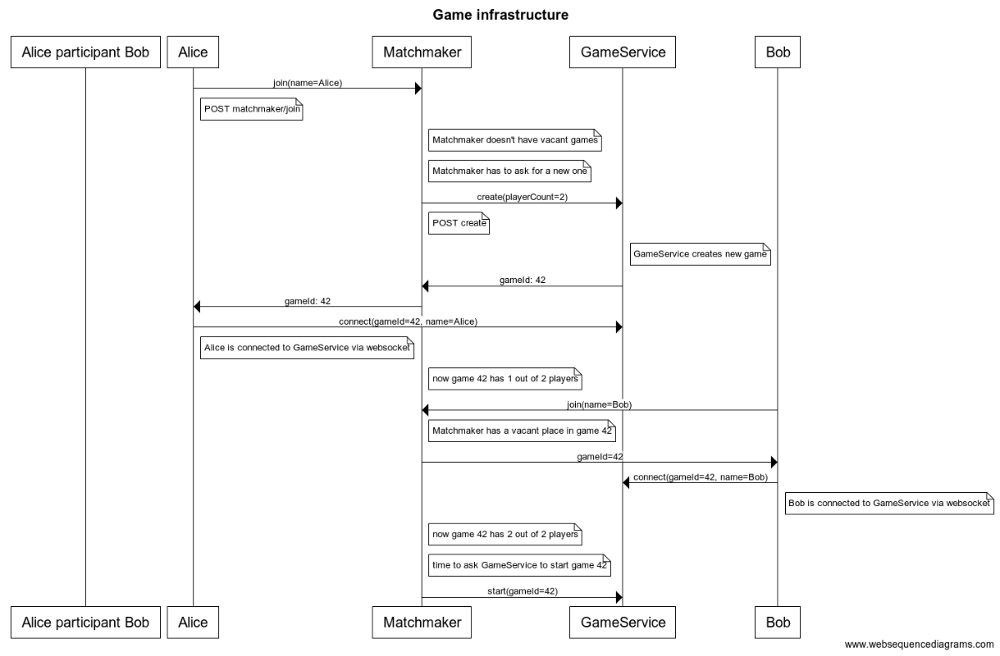

# Bomberman ifrastructure

We are going to start our game development. 
Now it's a part to create big part of our infrastructure, including matchmaker and landing page logic.
**game server** will be implemented later



API that our user see:
    `join(name: String)`
	User opens game web page (localhost:8080) and see the landing page (index page)
	with the only button [Play] and a text form to enter his nickname.


Under the hood (**Implement this service**):
1. Matchmaker service.
	Matchmaker should handle `play` button request from user and provide a valid game session id to the user
	User is waiting until Matchmaker will respond with the `game id`.  

	Specification  
	  ```
	    Protocol: HTTP
	    Path: matchmaker/join
	    Method: POST
	    Host: {IP}:8080 (IP = localhost for local server tests)
	    Headers:
		Content-Type: application/x-www-form-urlencoded
	    Body:
		name={}
	    Response: 
		Code: 200
		Сontent-Type: text/plain
		Body: game id
	  ```

	1.1) Matchmaker is creating a new games when necessary.
	Matchmaker provides same gameId to N client connections(players) 
	Matchmaking algorithm was described in lectures  
	  
	1.2) Matchmaker saves the info about the game to database:  
	gameId and all players involved (on game creation)  

	Bonus:
	
		- Monitoring - how many players are in queue and other interesting data 
		- Matchmaking based on leaderboard
		- Start match with not full players in game when have to wait for a long time

2. Game service (for now it should a stub/mock only)

	API:
	```
	gameId create(playerCount: int): long
	
	connect(name: String, gameId: long)

	start(gameId: long)
	```

	Under the hood:
	At some point Matchmaker asks Game service to `create` a new game for `playerCount` users.
	After that Matchmaker will provide this `gameId` to clients and clients will
	`connect` to the exact game using `gameId` and `name`

	At some point Matchmaker starts the game with `gameId`.
	In general it should be when number of connected players equals to number of players that should play in one game.

	Specification  
	```
	    Protocol: HTTP
	    Path: game/create
	    Method: POST
	    Host: {IP}:8090 (IP = localhost for local server tests)
	    Headers:
		Content-Type: application/x-www-form-urlencoded
	    Body:
		playerCount={}
	    Response: 
		Code: 200
		Сontent-Type: text/plain
		Body: game id
	```

	```
	    Protocol: HTTP
	    Path: game/start
	    Method: POST
	    Host: {IP}:8090 (IP = localhost for local server tests)
	    Headers:
		Content-Type: application/x-www-form-urlencoded
	    Body:
		gameId={}
	    Response: 
		Code: 200
		Сontent-Type: text/plain
		Body: game id
	```

	```
	    Protocol: WS
	    Path: game/connect?gameId={}&name={}
	    Host: {IP}:8090 (IP = localhost for local server tests)

	    Result: 
		WS connection established
	```
  	
	Bonus: 
	
		- Monitoring - how many games were played
		- Leaderboard
		- Player statistics


## Tech Stack:
### Spring & Spring-boot
**[Srping]( @TODO )** - the most popular java framework, web-mvc is a part of it.
**[Spring-boot]( @TODO)** - framework for fast configuration and deployment of java-spring applications.
**[Spring mvc]** - spring implementation of model-view-controller architectural pattern.

**Spring mvc implements thread per request model** [[link]](http://stackoverflow.com/questions/15217524/what-is-the-difference-between-thread-per-connection-vs-thread-per-request)  
Each request will be processed in separate thread.


## Deadline and HowTo?
- `git checkout -b matchmaker` and work in this branch
- create `game` directory in the root of repository and write code in this folder (travis-ci will build this directory)
- Deadline: **09.04** lecture.
- This is team task (3-2 persons, **single submissions are not aloud**) 
- Procedure:
    1. show us PR with green build
    1. show us a demo of your service
    1. show us your tests
    1. get ready for tricky questions
    1. java knowledge will be checked
- Base is **16 points** for this task
- The more features you will develop - the better rank you will get. Try to make the best service you can.
- If you are coping code from anywhere make sure you can explain what's happening.

## What we will check?
1. Correct implementation
1. Green CI build (checkstyle)
1. Tests quality (both unit and integration with SpringBootTest)
1. Code coverage > 50%
1. Logging
1. Service deployment in docker (without using IDE)

<!---
title Game infrastructure

participant Alice participant Bob
Alice->Matchmaker: join(name=Alice) 
note right of Alice: POST matchmaker/join 
note right of Matchmaker: Matchmaker doesn't have vacant games 
note right of Matchmaker: Matchmaker has to ask for a new one 
Matchmaker->GameService: create(playerCount=2) 
note right of Matchmaker: POST create 
note right of GameService: GameService creates new game 
GameService->Matchmaker: gameId: 42 
Matchmaker-> Alice: gameId: 42 
Alice-> GameService: connect(gameId=42, name=Alice) 
note right of Alice: Alice is connected to GameService via websocket 
note right of Matchmaker: now game 42 has 1 out of 2 players 
Bob->Matchmaker: join(name=Bob) 
note right of Matchmaker: Matchmaker has a vacant place in game 42 
Matchmaker->Bob: gameId=42 
Bob->GameService: connect(gameId=42, name=Bob) 
note right of Bob: Bob is connected to GameService via websocket
note right of Matchmaker: now game 42 has 2 out of 2 players 
note right of Matchmaker: time to ask GameService to start game 42 
Matchmaker->GameService: start(gameId=42)
-->
