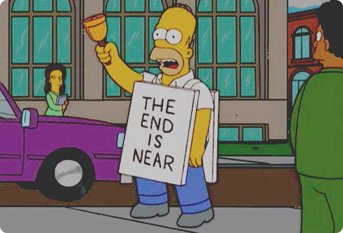

**Привет!**

Все молодцы, кто пережил 10 лекций и 3 рубежных контроля! Осталось совсем немного.

#План на ближайшее время:
Защита финального проекта будет состоять из двух частей

##Часть 1. Сode review (15 баллов)
**В четверг, 15 декабря, до вечера** ваша группа должна предоставить на ревью код игрового **сервера**. Предоставьте его в виде проекта на github или pull request там же. Игровой сервер должен подключаться к игровому клиенту. Вы можете также предоставить код игрового клиента, например, если вы внесли в него свои правки. Мы не будем проводить ревью кода игрового клиента.

Удачные исправления игрового клиента тоже оцениваются - присылайте их в виде pull-request. За каждый принятый pull-request мы дадим дополнительные баллы.

Во время ревью вы получите замечания, которые сможете исправить до вечера воскресенья, 18 декабря.

В реализации вашего конечного проекта мы даем вам больше свободы, чем на рубежных контролях - вы можете предложить любое технологическое решение, если сможете его отстоять на ревью.

###Что требуется:
1. Наличие аккаунт-сервиса с авторизацией через токен
2. Сохранение игрока в базу данных
3. Клиент-серверное взаимодействие через веб сокеты
4. Реализация игровой механики

###Что будем оценивать:
1. Корректность кода, правильное использование языковых конструкций, коллекций, следование принципам ООП
2. Чистоту и ясность кода, следование style guide java
3. Логгирование всех ключевых моментов, правильную обработку исключений

**Пожалуйста, подготовьте проект к ревью - удалите из репозитория лишние файлы (target), удалите неиспользуемый и закоментированный код**

##Часть 2. Защита проекта (15 баллов)
**Во вторник 20 декабря** в аудитории 411 мы проведем защиту ваших проектов.
Ваша группа должна будет подготовить небольшое выступление, в котором:

1. Покажет работающий проект
2. Расскажет и покажет, какие фичи удалось реализовать. Фичой может быть игровая механика или, например, ваши достижения в увеличении fps - любой значимый результат работы
3. Расскажет, как был построен процесс разработки в команде - какие инструменты вы использовали, у кого были какие роли

Вы можете подготовить презентацию, если вам удобно

##После защиты
После защиты мы подведем итоги курса, поговорим на интересующие вас темы

Напоминаю, что по итогам курса вы получите сертификат при условии, что **набрали 40 баллов и защитили свой проект**. Вручение сертификатов будет проходить после нового года в офисе mail.ru.

**Удачи!**
